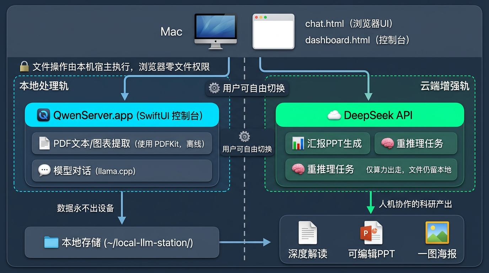

# local-llm-station

<div align="center">

**[English](README.en.md)** | **中文**

**🔬 读文献的人，值得一个懂文献的本地工作台——装进 Mac 的科研文献研读与汇报工具**



读一篇文献 → 讲清楚一篇文献 → 讨论它。离线可用 · 数据不出本机 · API 兼容 OpenAI。

[快速开始](#快速开始) · [5 分钟上手](#新手指南5-分钟跑通第一条文献工作流) · [功能详情](docs/features.md) · [FAQ](FAQ.md) · [跑不动本地模型？走云端](#零本地模型方案deepseek-云端-api旧电脑--无-mac-均可用)

</div>

## 它能做什么（30 秒版）

- **读进来**：上传 PDF，本地提取全文 + 图表位图 + 图内文字 OCR（扫描版自动整页 OCR），PDF 不出本机
- **读得懂**：背景/方法/结果/讨论四段解读；图表本地多模态深读；追问走缓存秒回
- **带得走**：🎨 一图总结海报 PNG · 📊 五段批判性框架汇报 PPT（可编辑 .pptx，逐图页 + 讲稿）
- **写得顺**：✍️ 写作台分章节写作，[@键] 引文、版本快照、AI 回复一键插入，导出 HTML / Word（引文样式可选）
- **修得回**：📮 投稿标记 → 收到审稿意见一键 fork 修稿版 → 意见逐条结构化（状态追踪 + Response 草稿）→ 🏥 落地体检防"信里说改了稿里没改" → 导出 point-by-point 回复信 + 🖍 高亮修改稿 Word（参考文献不标）
- **讨得深**：数据体检（GRIM 等确定性检验）· 引文校验 · 文献检索 · 文献库（BibTeX/RIS 互通 Zotero/EndNote）

完整功能清单、实现边界与配置细节见 **[docs/features.md](docs/features.md)**。

## 快速开始

**一键安装**（自动装 Homebrew/llama.cpp、克隆源码到 `~/Qwen38`、下载 27B 模型与 KaTeX、编译启动；国内可先 `export HF_ENDPOINT=https://hf-mirror.com`）：

```bash
bash <(curl -fsSL https://raw.githubusercontent.com/dalianblue/local-llm-station/main/install.sh)
```

内存不足 24GB 或暂不下载模型：`SKIP_MODEL=1` 运行上述命令。以下为手动分步（默认 Ollama 路线）：

```bash
# 1. 安装 Ollama 并拉取默认模型（NVFP4 量化约 18GB）
brew install ollama
ollama pull qwen3.8:27b-mlx

# 2. 可选：KaTeX 公式渲染资产（2.9MB，不入库；缺失时公式自动降级为原样文本，其余功能不受影响）
mkdir -p ~/Qwen38/katex && curl -sL https://registry.npmjs.org/katex/-/katex-0.16.11.tgz -o /tmp/katex.tgz \
  && tar xzf /tmp/katex.tgz -C ~/Qwen38/katex --strip-components=2 package/dist

# 3. 编译并启动控制台，app 里启动服务 → 开始对话
./build_local.sh && open LocalLLMServer.app
```

llama.cpp 路线（跑任意 GGUF，`build.sh` 构建 QwenServer.app）与换模型配置见 [docs/features.md](docs/features.md#换模型)。

## 新手指南：5 分钟跑通第一条文献工作流

装好后（见[快速开始](#快速开始)），照下面顺序走一遍，就是本站的全部核心玩法——每一步只有一个入口，不需要预先理解任何概念：

```
🏠 我的桌面（dashboard.html）—— 一切的入口，做完的事都变成一张卡片
```

**① 读一篇文献**
托盘 →「🌐 开始新对话」→ 输入框旁 📎 上传 PDF → 等提取完成，自动出**四段解读**（背景 / 方法 / 结果 / 讨论）。PDF 只在本机解析，不出网。想为综述攒原料？敲 `/` 选「证据提取」（RCT/Meta）或「观点提取」（论著），提取结果自动存进项目笔记。

**② 追问与图表深读**
对解读里任何一处继续提问（追问走缓存，秒回）；想细看图，直接输入「深读 图1,3 表2」——本地模型逐张看图讲组间差异，图表不出本机。解读结尾的「建议追问」点了就直接发。

**③ 讲给别人听**
- 🎨 **一图总结海报** PNG：本地秒出，适合快速汇报
- 📊 **汇报 PPT**：dashboard 点「文献转PPT」，五段批判性框架 + 逐图页 + 讲稿备注，云端生成约 2-3 分钟

**④ 写自己的稿子**
我的桌面「➕ 新建」→ ✍️ 新写作 → 按 背景/方法/结果/讨论 分章节写；右栏就是 AI——选段润色、让它查证，回答**一键插入光标处**（⌘Z 可撤销，插入前自动快照）。初稿写不动点「✨ 初稿」，写完点「🧭 检查」查跨章节一致性、「🕵️ 审稿」模拟四视角审稿——报告自动存档，可一键对照逐条修改。

**⑤ 引用与导出**
dashboard「📚 文献库」把读过的 PDF 扫描入库（自动抓 DOI）→ 编辑器里写 `[@键]` 引用（可点「引用」按钮插入）→ 状态栏 📤 **导出 HTML / Word**——Word 导出前可选引文样式（内置 AMA / Vancouver / APA / GB/T 7714，往 `~/Qwen38/csl/` 放 `.csl` 文件即扩充），pandoc citeproc 自动渲染编号引文与参考文献。

到这一步，读 → 懂 → 讲 → 写 → 引的闭环就走完了。

**⑥ 审稿意见回来了**
写作台状态栏「📮 投稿」标记投稿 → 收到意见点「收到审稿」**fork 出修稿版**（原投稿版自动锁定，点旧卡直达新项目）→「📨 审稿意见」粘贴整封 letter，AI 拆成逐条清单（Major/Minor 徽标、待处理计数）→ 逐条「💬」让 AI 给修改方案与 Response 草稿，改完稿点「🏥 体检」核对信里声称的修改是否真实落地 →「📤 回复信」导出 point-by-point Word，「🖍 高亮修改稿」导出改动行黄底版（参考文献自动不标）。二轮修稿再 fork 一次即可。

数据体检、引文校验、文献检索等进阶功能按需探索（见 [docs/features.md](docs/features.md) 与 [FAQ](FAQ.md)）；电脑跑不动 27B？看下面的云端方案。

> 💡 **想先看成品再上手？** 仓库自带一个示例写作项目（`examples/`，含 5 章节正文、版本快照与写作对话，演示 AI 插入 / 选中润色 / 跨章节检查）。拷入即可在「我的桌面」和编辑器里打开：
> ```bash
> cp -r examples/* chat_history/
> ```
> 示例只是一个普通项目，随时可删。

## 最低配置与速度参考

| 配置 | 说明 |
|------|------|
| **最低可用** | Apple Silicon（M1 及以后）+ 24GB 内存 + 约 20GB 磁盘（默认 Qwen3.8-27B Q4 量化） |
| **推荐** | 32GB 内存（可开 64K 上下文，多模态更从容） |
| **16GB 机器** | 换 14B 及以下量化模型，本站其余功能全部可用 |

**本机实测速度**（M1 Pro 32GB / Qwen3.8-27B UD-Q4_K_XL / 64K 上下文）：

| 指标 | 数值 |
|------|------|
| 模型加载 | ~30 秒 |
| 生成速度 | 5-8 tok/s（关闭深度思考） |
| 首字延迟 | 1-2 秒（短提问） |
| 纯文本对话流畅度 | 可用，长回答需等待 |
| OCR / 图片理解 | 单图 1-2K token，秒级出结果 |

模型能力四套件实测与 Ollama/llama.cpp 双后端对照见 [docs/benchmark.md](docs/benchmark.md)。

## 零本地模型方案：DeepSeek 云端 API（旧电脑 / 无 Mac 均可用）

电脑跑不动 27B（内存 <24GB、老 Intel Mac、Windows 轻薄本）？**不需要安装任何东西，一个浏览器 + DeepSeek API Key 即可用全部对话功能**：

1. **获取 API Key**：注册 [platform.deepseek.com](https://platform.deepseek.com)，充值后创建 Key（`sk-` 开头，几块钱可用很久）
2. **下载 chat.html**：只需仓库里的 `chat.html` 单文件（可选：连同 `katex/` 目录下载，公式渲染更好看；缺失时公式降级为原样文本）
3. **配置**：浏览器打开 chat.html → 右上角 ⚙️ 设置 → 「API 服务」选 **☁️ DeepSeek API** → 粘贴 Key。Key 仅存本机浏览器 localStorage，不经过任何第三方

配置完成即用：思考档自动映射 `deepseek-reasoner`，**对话完全不依赖本地服务**；跨对话记忆、会话管理、压缩、导出、📊 一键汇报 PPT 全部可用。两个可选增强（需 macOS 上跑 LocalLLMServer.app，不加载模型也可）：📄 PDF 本地提取、自动存档。注意：云端模式下对话内容会发送到 DeepSeek 服务器，上传数据文件前页面会弹"数据出本机"警示。

## 架构

```
dashboard.html（我的桌面：项目总览 + 全局状态，门户页）
   │  卡片悬停出底部双入口（💬 聊聊文献 | ✍️ 论文写作）；点卡片按类型分流兜底
   ▼
chat.html / editor.html（任意浏览器，纯 UI + localStorage 缓存）
   │  :11434/v1  对话 API（Ollama MLX，LocalLLMServer 启停；旧路线 :8080/v1 llama.cpp）
   │  :8081      存档 API（LocalLLMServer 内嵌微型 HTTP 服务）
   ▼
LocalLLMServer.app（宿主进程）
   ├── 启停 ollama serve / llama-server、上下文选择、运行时间/日志
   └── 读写 ~/local-llm-station/chat_history/*.json
```

推理后端双轨：**Ollama（MLX）** 为默认（`qwen3.8:27b-mlx`，视觉+思考原生、长思考任务快约 2 倍），**llama.cpp** 路线保留；前端按服务地址自动识别后端方言，切换只改设置。文件操作全部由本地宿主进程执行，浏览器零文件权限——这是本项目的核心设计：借鉴 deepseek-harness 的"本地宿主 + 浏览器纯 UI"分层，浏览器只是壳。完整存档 API 见 [docs/features.md](docs/features.md#存档-api8081带-cors仅供本机)。

## 文件说明与重新编译

| 文件 | 说明 |
|------|------|
| `chat.html` | 网页对话界面 |
| `editor.html` | ✍️ 写作台：分章节写作 + 版本快照 + AI 辅助三栏工作台 |
| `dashboard.html` | 我的桌面：项目仪表盘门户页（项目总览 + 全局状态 + 文献库） |
| `LocalLLMServer.swift` | 控制台 + 存档/PDF/图表提取/导出服务源码（Ollama 后端，`build_local.sh` 构建） |
| `QwenServer.swift` | 旧 llama.cpp 路线源码（`build.sh` 构建），功能基线保留 |
| `pptxgen.bundle.js` | PptxGenJS 单文件本地包（汇报 PPT 渲染，离线零 CDN） |
| `build_local.sh` · `build.sh` | 一键编译（自动生成 Info.plist；前者出 LocalLLMServer.app，后者出 QwenServer.app） |

```bash
./build_local.sh   # 改 LocalLLMServer.swift 后执行（Ollama 路线，默认）
./build.sh         # 旧 llama.cpp 路线（QwenServer.swift）；改 chat.html 等 HTML 刷新浏览器即可
```

## 深度文档

| 想了解 | 去哪里 |
|--------|--------|
| 完整功能清单、实现边界与配置（换模型 / 上下文与内存 / 存档 API / Windows-Linux） | [docs/features.md](docs/features.md) |
| 模型能力实测、试卷与双后端对照 | [docs/benchmark.md](docs/benchmark.md) · [benchmark/](benchmark/) |
| 产品定位与常见疑问 | [FAQ.md](FAQ.md) |
| 作者为什么做这样一款软件 | [docs/story.md](docs/story.md) |
| 路线图（短期/中期计划与欢迎 PR 的方向） | [docs/roadmap.md](docs/roadmap.md) |
| 移植到 Windows/Linux 的 API 协议规范 | [PORTING.md](PORTING.md) |
| 如何贡献（接受的 PR 类型与约定） | [CONTRIBUTING.md](CONTRIBUTING.md) |

## 致谢

- [Crossref](https://www.crossref.org) / [OpenAlex](https://openalex.org)——引文校验使用的两个免费公开学术元数据 API（排序而非生成，零幻觉查证）
- [PaSaMaster: Towards Self-Evolving Agentic Literature Retrieval (arXiv:2605.14306)](https://arxiv.org/abs/2605.14306)——引文校验"查证走数据库排序比对、绝不让模型凭记忆生成"的架构借鉴自它
- [deepseek-ai/deepseek-harness](https://github.com/deepseek-ai/deepseek-harness)——本项目的"本地宿主进程执行文件操作、浏览器只做纯 UI"分层架构借鉴自它
- [ggml-org/llama.cpp](https://github.com/ggml-org/llama.cpp)——推理引擎
- [unsloth](https://unsloth.ai)——高质量动态量化 GGUF
- [KaTeX](https://katex.org) / [html2canvas](https://github.com/niklasvh/html2canvas) / [PptxGenJS](https://gitbrent.github.io/PptxGenJS/)——公式渲染、PNG 导出与可编辑 PPTX 生成

## License

AGPL-3.0（网络服务部署同样适用传染条款：衍生品无论以何种形式提供服务，须向用户提供源码）
